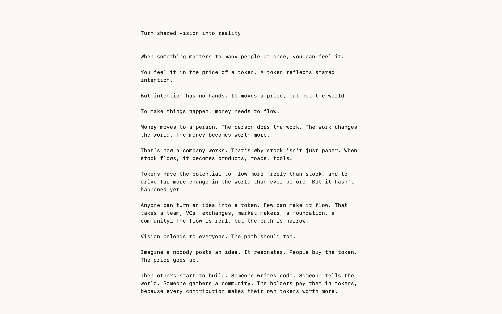
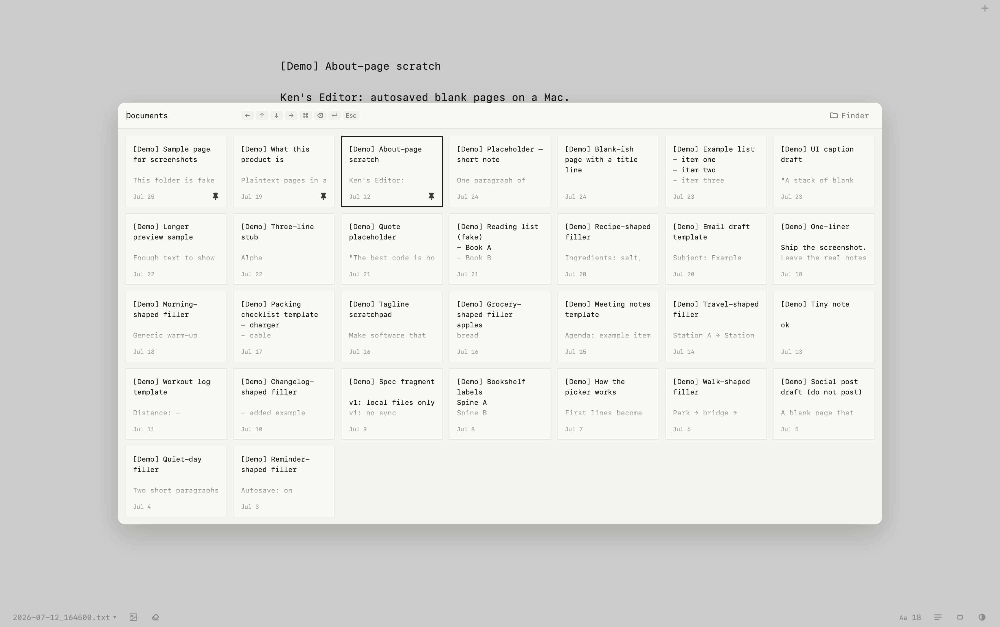
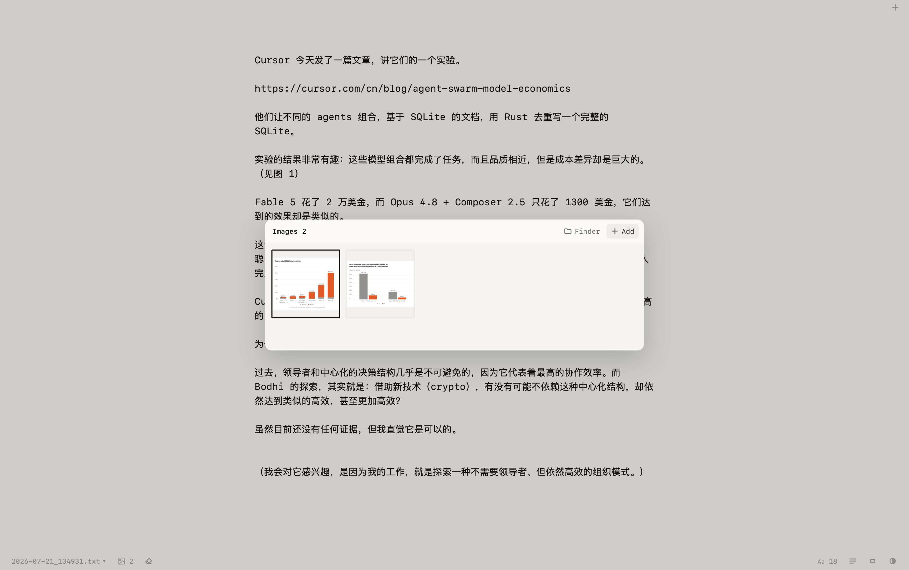
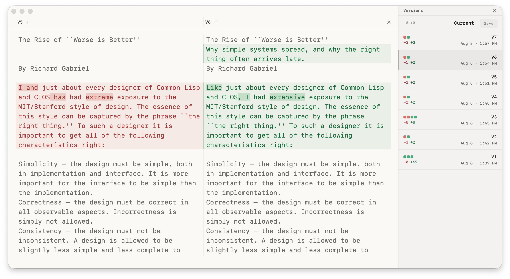

# Ken's Editor

A stack of autosaved blank pages on a Mac. Write, flip, done.

Plain text only, saved as `.txt` in `~/Documents/KensEditor/`. No Markdown. Not a notes app.







## Update 2026-08-08

New: every save keeps a version. The version history shows what changed and lets you copy or restore any of them.



## Run it

Needs macOS, [Node.js](https://nodejs.org/), and [Rust](https://rustup.rs/).

```bash
npm install
npm run tauri dev      # try it
npm run tauri build    # build the app
```

MIT licensed.
